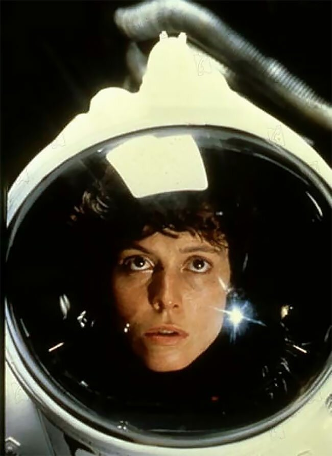

# Инструкция для работы с Markdown

## Выделение текста
Чтобы выделить текст курсивом необходимо обрамить его звездочками (*) или знаком нижнего подчеркивания (_) *Вот так* или _Вот так_

Чтобы сделать текст полужирным, нужно обрамить его двойными звездочками (**) или двойным знаком нижнего подчеркивания (__) **Вот так** или __Вот так__

Альтернативные способы выделения текста жирным или курсивом нужны для совмещения обоих способов

_Текст может быть выделен курсивом и при этом быть **полужирным**_
## Списки

## Работа с изображением

Чтобы вставить изображение в текст, нужно написать следующее: ! [] () 
в квадратных скобках любой текст, в круглых название файла картинки с расширением 

## Ссылки

## Работа с таблицами

## Цитаты

## Заключение 